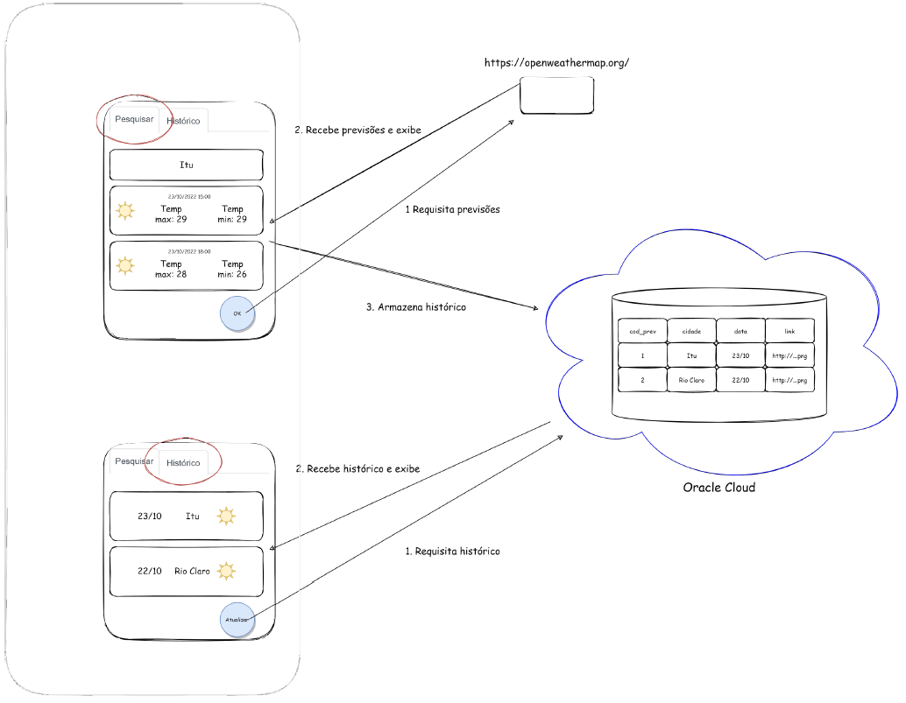

# **Programação para Dispositivos Móveis**
## 5º Semestre do curso de *Análise e Desenvolvimento de Sistemas*
## **Professor:** Rodrigo Bossini
#
# **Projeto P2 - APP Previsão do Tempo**
# **Grupo**
| Nome | RA |
| ------------- | ------------- |
| Alana Roberta Santos da Costa Martins  | 2040482023033  |
| Diego Mendes Carloni  | 2040482023037  |
| Gabriel Garcia Fernandes | 2040482022019 |
| Jaqueline Cantarino Cassimiro  | 2040482023010  |
| Mayara Pereira Dotta  | 2040482023049  |
#
## Neste projeto, foi desenvolvido a solução computacional retratada pela Figura 1:
- **Trata-se de uma aplicação com duas telas:**
- A primeira tela possui um botão que permite ao usuário realizar uma consulta a
um serviço de previsão do tempo. Uma vez feita a consulta, a lista de resultados
obtidos é exibida. Além disso, a aplicação registra que uma consulta foi realizada
na base de histórico.
- A segunda tela permite ao usuário consultar o histórico de consultas já
realizadas.

#
# **Resultado do projeto desenvolvido:**
## **Interface**

  

### **Banco de dados**

  